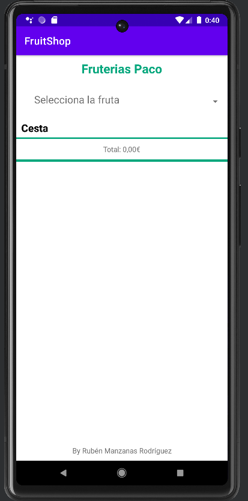
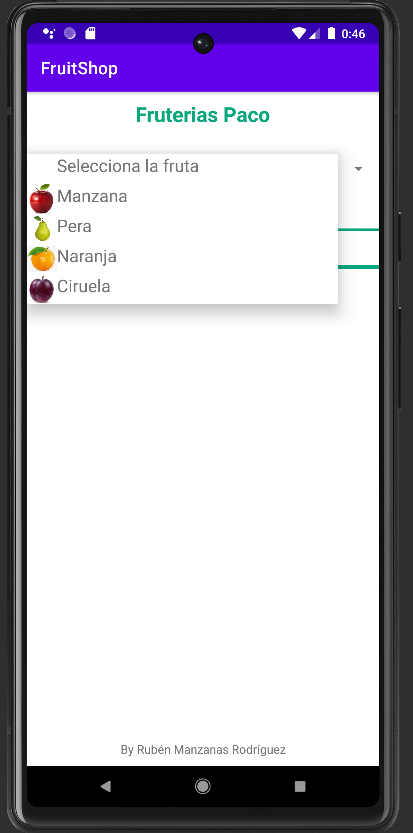
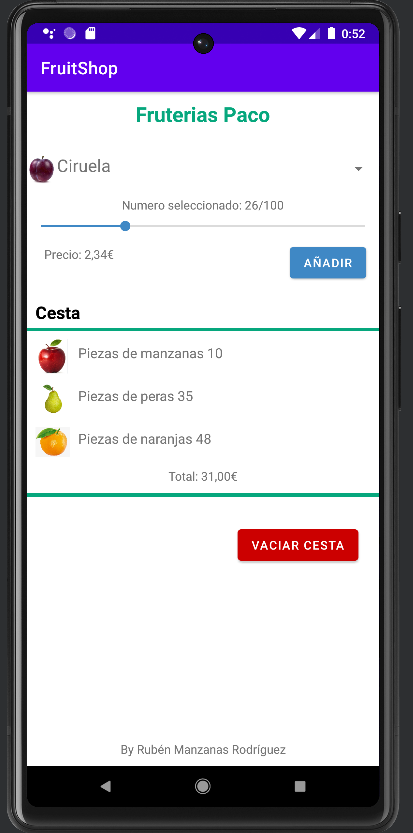
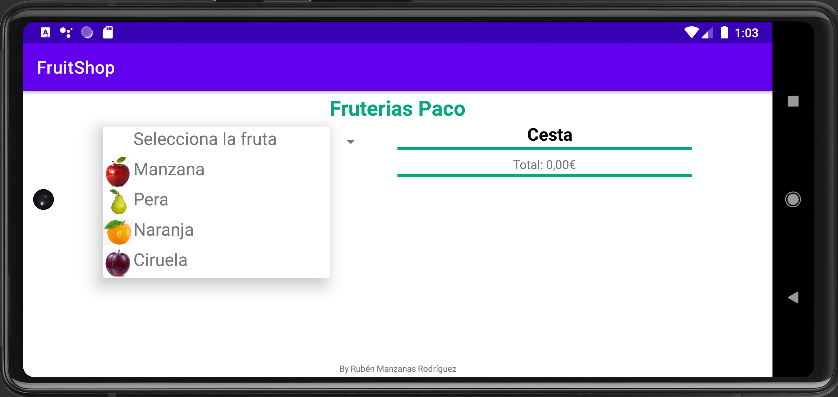
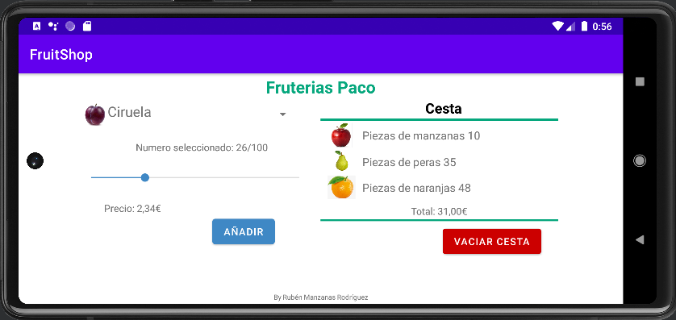
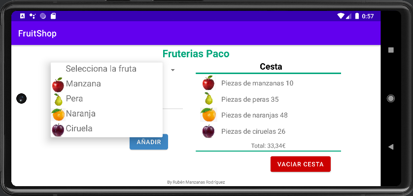
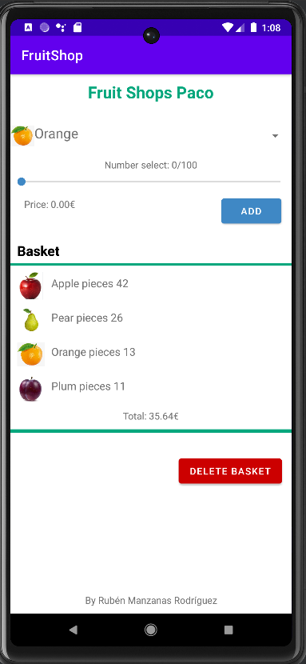

# LABORATORIO DE SISTEMAS MOVILES Y UBICUOS 

#### *Fecha: 08/03/2023*
#### *Autor : Rubén Manzanas Rodríguez*

 

>## **FruitShop**

Esta aplicación ha sido creada con el propósito de crear una app para una frutería.
Inicialmente, al ejecutar la aplicación aparecerá un titulo con el nombre de la frutería, un Spinner para seleccionar la fruta que queremos añadir, una cesta que inicialmente estará vacía y se irá actualizando de forma automática cada vez que se añada una fruta. Al final de la cesta aparecerá el coste total de todos los productos que se han añadido. 

Inicialmente este Spinner estará en posición "Select the fruit". Al desplegar el Spinner aparecerá una foto de cada fruta junto al nombre. Al elegir una fruta aparecerá de forma automática un SeekBar donde se podrá elegir la cantidad de producto que queramos, un texto donde aparecerá de forma dinámica el número de elementos que se van seleccionando cuando se desliza el SeekBar y otro texto donde aparecerá el importe del producto que se ha seleccionado. También aparecerá un botón de color azul para añadir el producto a la cesta.

Cuando se pulsa el botón y se añade un producto a la cesta, esta se actualiza de forma automática mostrando la foto y nombre del producto seleccionado junto con la cantidad. Al final de la cesta aparecerá el importe total de todos los productos de la cesta, este importe se actualiza de forma instantánea cada vez que se añade un producto a la cesta. 

Cuando el programa detecte que la cesta contiene un producto aparecerá un botón de color rojo dándole la posibilidad al usuario de vaciar la cesta. Al vaciar la cesta todos los productos que había en esta se eliminarán.

La aplicación permite el cambio de orientación, es decir, permite que se utilice de forma horizontal y vertical.

La aplicación tendrá persistencia de la información a cambios de orientación.

La aplicación soporta el multilenguaje Eng/Esp según la configuración del teléfono.

Al final de la pantalla aparecerá la firma del autor de la aplicación.

 

>## Extras

Los extras que se han incluido en la aplicación y en la práctica son:

* Persistencia de la información entre cambios de orientación.
* Fotografía del producto en el spinner.
* Fotografía del producto en la cesta.
* Las pantallas horizontal y vertical tendrán un layout diferente acorde con el espacio proporcionado
* Soporte multilenguaje Eng/Esp según configuración del teléfono.
* Posibilidad de vaciar la cesta gracias a un botón
* Evitar tener que pulsar el botón para seleccionar una fruta en el Spinner
* Prueba de concepto, limitada a cuatro frutas.
* Mejora que haga la pantalla más atractiva desde el punto de vista funcional como:
    * Delimitación de la cesta entre barras
    * Letras de distinto tamaño y colores
    * Botones de diferentes colores en función de su utilidad 
    * Cambio de color del SeekBar 

### Spinner

El Spinner mostrará 5 opciones a elegir , 4 frutas y un elemento neutro "Select the fruit". Cuando este elemento está presente desaparece en pantalla todos los elementos que están relacionados con la selección de la fruta como por ejemplo, el SeekBar, la cantidad de producto seleccionado, el precio de ese producto seleccionado y el botón de añadir a la cesta.

Al seleccionar una fruta en el spinner se restablecen todos los elementos necesarios para añadir una fruta.

El spinner contendrá una foto del producto junto con el nombre del producto.

 

### SeekBar

El SeekBar se utilizará para seleccionar la cantidad de producto que se desea añadir a la cesta, el valor máximo del es de 100. A medida que se va deslizando el SeekBar para seleccionar el producto cambiará de forma automática el número de producto y el precio en función de la cantidad seleccionada.

 

### Botón Add

La utilidad de este botón será la de añadir el producto que se ha seleccionado en el SeekBar a la cesta.

 

### Cesta 

La cesta será dinámica, es decir, a medida que se van añadiendo los productos, la cesta va aumentando su tamaño.
En la cesta aparecerá todos los productos seleccionados junto a una fotografía, el nombre del producto seleccionado y la cantidad.
Al final de la cesta aparecerá el coste total de todos los productos que se han añadido a la cesta

 

### Botón Delete Basket

Debajo de la cesta, cuando esta contenga algún producto aparecerá un botón de color rojo permitiendo al usuario vaciar la cesta. Cuando la cesta esté vacía este botón no será visible.

>## Imágenes
 

Fotos de la aplicación al ejecutarse:
 

* Vertical: 

    * 

    * 

    * 

* Horizontal:

    * 

    * 

    * 

*   Aplicación en ingles: 

   * 
